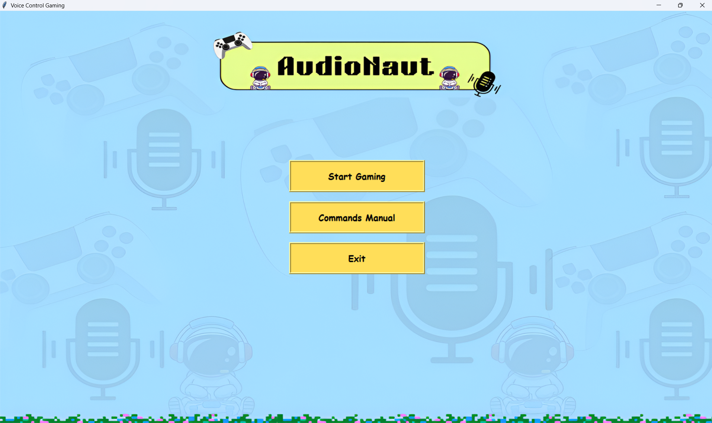
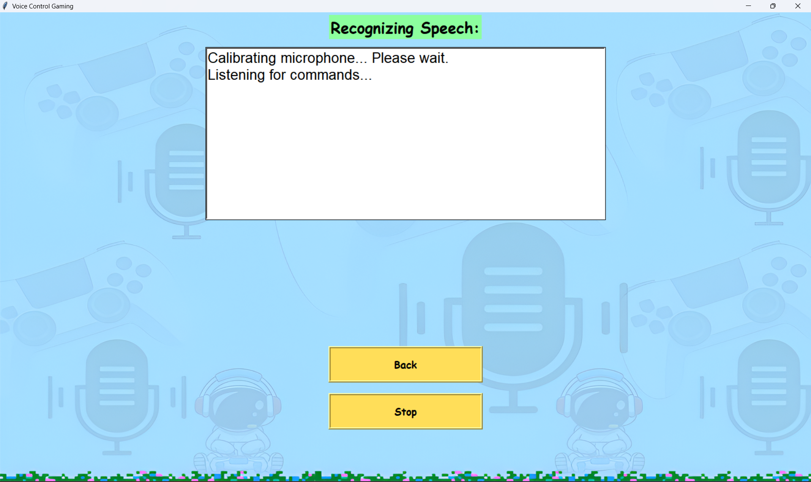
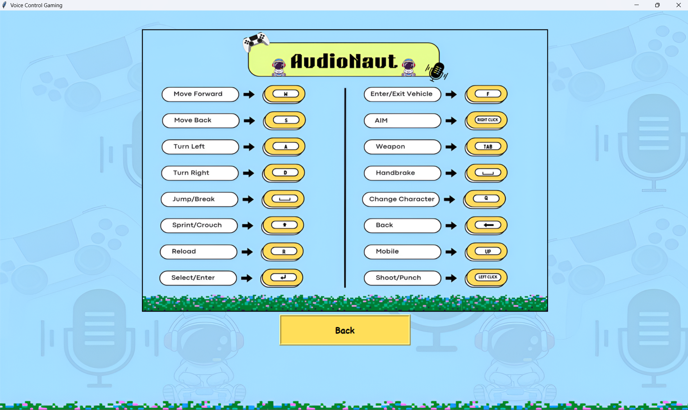

# AudioNaut
AudioNaut is a customizable voice-controlled gaming interface. It lets players control any PC game using spoken commands mapped to keyboard and mouse actions. Commands are fully editable, making it easy to add, remove, or modify controls for any game, highly optimized for games like **GTA V**.

## Features
- Fullscreen gaming UI
- Real-time speech recognition
- Editable voice command list
- Image-based manual
- Supports any PC game

## How to Run
1. Install Python 3.10+
2. Install requirements:
pip install -r requirements.txt

3. Run the UI:
python voiceUI.py

📁 Project Structure
AudioNaut/

├── voiceUI.py

├── Voice_Commands.py

├── gaming manual.png

├── TEXTBOX BG.png    

└── UI BG.png

└── README.md 

└── requirements.txt    

## Add Your Own Commands
Open `Voice_Commands.py` and edit the `commands = { ... }` dictionary.  
You can add new voice phrases or change the actions they perform.

Example:
"reload weapon": "r",
"drive fast": "shift",

## USE HEADSET WITH GOOD MIC!!!

🎙️ Important Notes
Make sure your microphone is properly configured
👉 Check in:
Windows Settings → System → Sound → Input Device
If commands are not being recognized:
Ensure correct input device is selected
Speak clearly and use defined commands
Check internet connection (Google Speech API dependency)

## Requirements
- Python 3.10+
- Microphone
- Internet connection for speech recognition

  ## 📸 UI Preview

### 🏠 Main Interface

### 🎮 Voice in Action

### 📚 Command Manual

If you like this project, consider starring ⭐ the repository!
